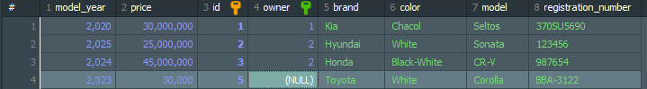

- Entity 클래스의 경우에는 DB에서 table역할을 한다.
- Entity 클래스의 ield들은 column역할을 한다.
- JPA와 연동 되어 있기 때문에 필수적으로 기본 생성자를 요구한다.
- id 값을 AUTO로 잡아 놨기 때문에 (즉, 생성될 때 마다 하나씩 증가하도록 id값이 설정 되어있다)그래서 모든 매개변수가 필요한 @AllArgsConstructor를 사용하지 못한다.

Owner의 작성

```java
package com.example.cardatabase.domain;

import jakarta.persistence.Entity;
import jakarta.persistence.GeneratedValue;
import jakarta.persistence.GenerationType;
import jakarta.persistence.Id;
import lombok.*;

@Entity
public class Owner {
    @Id
    @GeneratedValue(strategy = GenerationType.AUTO)
    private Long ownerId;


    private String firstName, lastName;


    public Owner() {
    }


    public Owner(String firstName, String lastName) {
        this.firstName = firstName;
        this.lastName = lastName;
    }


    public String getFirstName() {
        return firstName;
    }

    public void setFirstName(String firstName) {
        this.firstName = firstName;
    }

    public String getLastName() {
        return lastName;
    }

    public void setLastName(String lastName) {
        this.lastName = lastName;
    }

    public Long getOwnerId() {
        return ownerId;
    }

    public void setOwnerId(Long ownerId) {
        this.ownerId = ownerId;
    }
}
```

Lombok 사용 버전

```java
package com.example.cardatabase.domain;

import jakarta.persistence.Entity;
import jakarta.persistence.GeneratedValue;
import jakarta.persistence.GenerationType;
import jakarta.persistence.Id;
import lombok.*;

@Entity
@Data
@NoArgsConstructor(force = true)
@RequiredArgsConstructor
public class Owner {
    @Id
    @GeneratedValue(strategy = GenerationType.AUTO)
    private Long ownerId;

    private final String firstName, lastName;

}
```

- `@RequiredArgsConstructor`의 사용의 경우 final 을 사용할 경우 기본 생성자와 겹치기 때문에  `@NoArgsConstructor(force = true)`처럼 force = ture의
  적용이 필요하다.
- `final`키워드 적용 대신 `@NonNull`의 애너테이션을 사용할 경우 기본 생성자와 충돌이 일어나지 않기 때문에 이쪽을 선호하는 편이다.

## 테이블 간의 관계 추가

car 테이블과 일대다(1:N) 관계에 있는 owner라는 새 테이블을 만들고. 일대다 관계는 소유자가 한명이 자동차 여러 대를 가질 수 있지만, 한 자동차의 소유자는 한 명이라는 의미이다.  
domain 패키지에 Owner이라는 엔티티 클래스와 OwnerRepository라는 repository 인터페이스를 만들어야 합니다. 그리고 OwnerRepository는 JpaRepository를 상속 받아야
한다.

이상의 일대다 관계를 추가하려면 `@ManyToOne`과 `@OneToMany`의 애너테이션을 이용해야 합니다. 외래키를 포함한 Car 엔티티 클래스에서는 `@ManyToOne`을 사용할 것이다. 그리고 외래키를
추가 했기 때문에 필드 구성이 달라져야 한다.

그럼 DB적으로 봤을 때는 car table에다가 외래키인 ownerId를 추가하는 개념이라고 볼 수 있기 때문에 Car entity class에는 Owner 관련 필드를 추가 하여야 한다. 새로 추가된 field에
대한 게터 세터도 추가야 하며, 모든 JOIN관계에서는 FetchType.LAZY를 이용하는게 좋다. 대다(toMany) 관계의 경우에는 FetchType.LAZY가 기본 값이므로 정의할 필요가 없지만 대일 관계의
경우에는 반드시 명시해 줘야한다.

### Fetch Type

- DB데이터를 검색하는 전략을 정의
- 속성값으로는 EAGER, LAZY가 존재
- EAGER : 즉시 검색
- LAZY : 지연 검색
  예제에서는 지연 검색은 DB에서 소유자를 검색하면 필요할 때 해당 소유자와 연관된 모든 자동차를 검색한다는 의미입니다. 반명 즉시 검색은 해당 소유자의 모든 자동차를 즉시 검색합니다.

```java
package com.example.cardatabase.domain;

import jakarta.persistence.*;
import lombok.*;

import java.util.*;

@Entity
@Data
@NoArgsConstructor(force = true)
@RequiredArgsConstructor
public class Owner {
    @Id
    @GeneratedValue(strategy = GenerationType.AUTO)
    private Long ownerId;

    @NonNull
    private String firstName, lastName;

    // 소유자는 다수의 차들을 가징수 있기 때문에 Collections를 사용
    @OneToMany(cascade = CascadeType.ALL, mappedBy = "owner")
    private List<Car> cars;

}
```

```java
package com.example.cardatabase.domain;

import jakarta.persistence.*;
import lombok.*;

@Data
@Entity
@NoArgsConstructor
public class Car {
    @Id
    @GeneratedValue(strategy = GenerationType.AUTO)     // DB에 있는 AUTO_INCREMENT와 동일 자동으로 1씩 증가하며 값을 부여
    private Long id;
    private String brand, model, color, registrationNumber;
    private int modelYear, price;

    @ManyToOne(fetch = FetchType.LAZY)
    @JoinColumn(name = "owner")
    private Owner owner;

    public Owner getOwner() {
        return owner;
    }

    public void setOwner(Owner owner) {
        this.owner = owner;
    }

    public Car(String brand, String model, String color, String registrationNumber, int modelYear, int price) {
        this.brand = brand;
        this.model = model;
        this.color = color;
        this.registrationNumber = registrationNumber;
        this.modelYear = modelYear;
        this.price = price;
    }
}
```

이상에 코드에서 `@Data`를 달아둔 경우에 일부러 겹치지만 Owner와 관련된 Getter/Setter를 코드로 작성. 반면에 `@Getter,@Setter`를 명시해둔 Owner 클래스에는 cars 관련
Getter / Setter를 안 썻다. 프로젝트 실 진입 시에는 코드 작성 필요 없다.

Owner class의 `@oneToMany` 애너테이션에는 특성이 있습니다.

1. cascade 속성은 삭제 / 업데이트 시 연속 효과가 적용되는 방법을 지정합니다.
    - ALL로 설정하게 되면 모든 작업이 연속적으로 적용됩니다.
    - 예로 Owner를 삭제 하게 되면 그 소유자를 연결된 객체들도 모두 삭제된다.
2. mappedBy = "owner" 속성 설정 : Car 클래스 사이에 이 관계인 외래키인 owner 필드가 존재함을 명시함.

SQL을 배운 저희가 어색하게 느껴질 수 있는 것은 OwnerId 필드 하나만 가지고 와서 연결 짓는게 아니라 Owner 클래스를 통째로 들고와서 Car에 field로 삼는다.

## H2 -> MariaDB로 이식

build.gradle에 h2 과녈ㄴ 의존성 있는지 여부
application.properties에서 h2관련으로 접속하는지 여부
MariaDB로 바꾼다는 말은 build.gradle / application.properties 설정을 바꿀 예정이다.

1. HeidiSQL에서 관련 DB 생성
2. 새 DB 생성 -> cardb
3.
4. application.properties 설정

```properties
spring.application.name=cardatabase
spring.datasource.url=jdbc:mariadb://localhost:3306/cardb
spring.datasource.username=root
spring.datasource.password=1234
spring.datasource.driver-class-name=org.mariadb.jdbc.Driver
spring.jpa.generate-ddl=true
spring.jpa.hibernate.ddl-auto=create-drop
```

spring.jpa.generate-ddl=true 설정은 JPA가 데이터 베이스를 초기화해야 하는지(true/false) 여부를 정의합니다.

spring.jpa.hibernate.dda-auto=create-drop 설정은 데이터베이스 초기화의 작동을 정의. 이용 가능한 값은 none / validate / update / create /
create-drop 으로 기본값은 db마다 다릅니다. h2인메모리의 경우에는 기본적으로 create-drop인데, mariadb는 none입니다.

- creat : 애플리케이션이 시작될 때 데이터베이스를 생성하기만 함(그래서 create로 해놓고 동일한 테이블명을 설정해 두면 오류납니다.)
- update : 데이터베이스를 생성하고 스키마가 변경되면 수정.
- create-drop : 애플리케이션이 시작될때마다 db를 생성하고 중지될 때마다 삭제 -> 그래서 잦은 변경사항이 있는 개발 환경에서 얘를 쓰는 편

springboot 프로젝트 생성
entity class - repository의 관계성 (Lombok 유무에 따른 코드라인 변경 사항 작성)
mariadb이식과 관련된 사항

이상까지 작성했다고 가정했을 때 , CardatabaseApplication에 CommendLineRunner를 활용한 더미 데이터를 넣는 것이 좀 번거롭게 느껴질 수 있습니다. 저희는 이미 SQL문을 배웠고,
그렇다면 곧장 테이블에 값을 넣을 수 있기 때문에.

근데 create-drop 때문에 할 때마다 날라가서 쿼리문을 째로 복사해 뒀다가 실행할 때마다 붙여 넣던가, 아니면 삭제 되지 않게 하거나 하는 조정이 필요하다.

# RESTful API SpringBoot ver.

Spring Data REST를 이용하기 CRUD 기능을 자동을로 제공하는 RESTful 웹 서비스를 만들고, 그것을 OpenAPI 3(Swagger)로 API 명세서도 만들 예정.

## REST 기초

- 웹 서비스를 제작하기 위한 아키텍처 스타일. Representational State Transfer 를 뜻하며 특정 언어나 플랫폼에 독립적이며 모바일 앱 / 기타 서비스와 같은 다양한 클라이언트들이 서로 통신할
  수 있도록 함.
- 근데 정해진 규칙이 있는 프레임워크라 꼭 이런식으로 작성하세요, 라는 의미가 아니라 로이필딩이라고 하는 개발자가 제시한 제약 조건의 집합니다.
- REST의 제약 조건
    1. 상태 비저장 : 서버랑 클라이언트 상태에 관한 어떤 정보도 저장하지 않음.
    2. 클라이언트 - 서버 간의 독립성 : 클라이언트와 서버는 독립적으로 작동해야 한다. 서버는 클라이언트의 요청 없이 어떠한 정보도 전송해서는 안된다.
    3. 캐시 가능 : 여러 클라이언트가 동일한 리소스를 요청하는 경우가 많으므로 성능 향상을 위해 리소스에 캐싱을 적용해야함.
    4. 일관된 인터페이스 : 서로 다른 클라이언트에 의한 요청이더라도 응답은 동일하게 보여야한다. 클라이언트의 예시로는 브라우저 / 자바 애플리케이션 / 모바일 애플리케이션 등
    5. 계층형 시스템 : 전체 서비스에 영향을 주지 않고 구성 요소를 추가하거나 수정할 수 있어야 한다. 이 조건은 확장성과 관련있따. 당근 마켓에 갑자기 지도 추가되거나 혹은 채팅이 추가되거나, 또한 가격
       변동에 대한 알람 등 기능이 추가 되더라도 당근 마켓 자체 멈추지 않죠.
    6. 주문형 코드 : 선택 사항에 해당하는데, 대부분의 서버는 정적 컨텐츠를 JSOM 또는 XML 형식으로 전송한다. 이는 서버가 정적 컨텐츠만이 아니라 실행 코드를 전송할 수 있도록 함.
- REST 아키텍처에 포함되어야 하는 요소들.
    1. 리소스 식별 : 리소스는 고유 식별자 (예를 들어 REST 서비스의 URI)로 식별해야 한다. REST 리소스는 이해하기 쉬운 디렉토리 구조의 URI를 노출해야 한다.
    2. 표현을 통한 리소스 조작 : 리소스를 요청할 때 서버는 리소스의 표현으로 응답해야함. 일반적인 표현형식으로 JSON / XML
    3. 자체적인 설명 메시지 : 메시지는 서버가 처리방법을 알 수 있는 충분한 정보가 포함되어야 한다.
    4. HATEOAS(Hypermedia As The Engine Of Application State) : 응답에는 서비스의 다른 영역으로 연결되는 링크가 포함되어야 한다.

## SpringBoot로 RESTful API 웹 서비스 만들기

- 이제 Controller 클래스가 필요. Controller는 모든 HTTP 요청을 처리하는 클래스를 의미한다.
- cardatabase 패키지에 web이라는 패키지 생성
- web 패키지 내에 CarController라고 하는 java class 생성

```java
package com.example.cardatabase.web;

import org.springframework.web.bind.annotation.RestController;

@RestController
public class CarController {
}
```

`@RestController` : 해당 클래스가 RESTful API 웹 서비스 상의 Controller가 될 것을 지정함.

- 메서드들이 포함될 예정. Controller 클래스의 메서드에는 메서드가 매핑되는 엔드 포인트를 정의하는 @RequestMapping 애너테이션을 지정할 예정. 예를 들어 `/cars`엔트포인트로 GET 요청을
  하게 됐을 때 getCars() 메서드를 호출하게 할 겁니다.

```java
package com.example.cardatabase.web;

import com.example.cardatabase.domain.Car;
import org.springframework.web.bind.annotation.GetMapping;
import org.springframework.web.bind.annotation.RestController;

@RestController
public class CarController {
    @GetMapping("/cars")
    public Iterable<Car> getCars() {
        //자동차를 검색하고 반환할 코드
    }
}
```

이상의 상태에서 getCars() 메서드는 모든 자동차 객체를 반환한 다음에 Jackson 라이브러리에 의해서 자동으로 JSON 객체로 변환된다.

그리고 getCars() 메서드는 `@GetMapping` 애너테이션을 이용하기 때문에 `/cars`엔드포인트에 GET요청만 처리합니다. 즉 SQL문 상에서 SELECT 요청만 처리한다는 의겠네요. 또한 그 말은
`@PostMapping`에서는 SQL문 상에서 INSERT 요청만 처리한다는 뜻이 되겠습니다. `@---Mapping`만 보고도 어떤 역할을 하는 method인지 우리는 추측할 수 있다.

`@PostMapping`, `@GetMapping`, `@DeleteMapping`등이 존재한다. 이러한 POST / GET / DELETE / 등을 HTTP 메서드라고 표현한다.

그러면 getCars()를 호출한다 했을때 어디에서 자동차 목록을 가지고 올 수 있을지 로직을 생각해야 한다.

```java
package com.example.cardatabase.web;

import com.example.cardatabase.domain.Car;
import com.example.cardatabase.domain.CarRepository;
import org.springframework.web.bind.annotation.GetMapping;
import org.springframework.web.bind.annotation.RestController;

@RestController
public class CarController {
    private final CarRepository carRepository;

    public CarController(CarRepository carRepository) {
        this.carRepository = carRepository;
    }

    @GetMapping("/cars")
    public Iterable<Car> getCars() {
        return carRepository.findAll();
    }
}

```

당연히 자동차들이 저장되어있는 곳은 car 테이블 일거니깐, SELECT * FROM car;를 호출 할 수 있는 CarRepository가 필요합니다.
그래서 Controller에서 CarRepository를 사용할 수 있도록 field로 선언하고, final을 지정해 주었다. CarController에 CarRepository가 포함되어있는 매개변수 생성자를
만들었다. 그러면 CarController는 carRepository에 딸려있는 메서드인 .findAll();을 통해서 전체 자동차를 모록을 return 할 수 있게 된다.

현새 상황에서 생길 수 있는 문제

1. 자동차 목록을 다 가지고 옵니다.
2. 근데 자동차 목록의 각각의 filed들에는 Owner가 포함되어있습니다.
3. 근데 그 Owner에는 cars라고 하는 field가 있습니다.
4. 그리고 그 Cars List 내에는 각각의 element로 car 객체들이 있다.
5. 그 car 객체의 field로 Owner가 포함
6. 무한반복

그래서 Owner.java파일에서 `@JsonIgnoreProperties({"hibernateLazyInitializer", "handler"})"`와 cars 필드에 `@JsonIgnore`를 적용하게 되면 무한
반복을 무시할 수 있습니다.

```java
package com.example.cardatabase.domain;

import com.fasterxml.jackson.annotation.JsonIgnore;
import com.fasterxml.jackson.annotation.JsonIgnoreProperties;
import jakarta.persistence.*;
import lombok.*;

import java.util.*;

@Entity
@JsonIgnoreProperties({"hibernateLazyInitializer", "handler"})
@Data
@NoArgsConstructor(force = true)
@RequiredArgsConstructor
public class Owner {
    @Id
    @GeneratedValue(strategy = GenerationType.AUTO)
    private Long ownerId;

    @NonNull
    private String firstName, lastName;

    // 소유자는 다수의 차들을 가징수 있기 때문에 Collections를 사용
    @JsonIgnore
    @OneToMany(cascade = CascadeType.ALL, mappedBy = "owner")
    private List<Car> cars;

}

```

- 참조
    - `@JsonIgnoreProperties({"hibernateLazyInitializer"."handler"})`
    - `@JsonIgnoreProperties(value값)` : JSON 출력 시에 지정된 속성 무시
    - `@JsonIgnoreProperties({"속성1","속성2"})` : JSON 출력시 지정된 속성 무시
    - JSON 직렬화 / 역직렬화 과정에서 특정 속성을 무시하도록 하는 Jackson 라이브러리상의 애너테이션에 해당합니다.
    - hibernateLazyInitializer
    - handler
        - JPA 프록시 객체에서 발생하게 되는 특수한 필드 중에 이상의 두 속성은 JPA가 지연로딩(Lazy Loading)을 위해서 생성하는 내부 필드인데, 얘네가 JSON에 포함되게 되면 오류가 발생할
          수 있어서 default 값으로 제외시키는 용도입니다.
    - 결과적으로 `@JsonIgnoreProperties`는 이상의 두 필드를 제외시키기 위함이다.
    - `@JsonIgnore`이 field 레벨에서 JSON 직렬화를 박는 애너테이션이라고 해석할 수 있겠다.

## Spring Data REST 이용

- Spring Data REST는 스프링 데이터 프로젝트의 일부로, 스프링으로 RESTful 웹 서비스를 빠르게 구현할 수 있도록 도와주는 의존성. Spring Data REST는 클라이언트가 하이퍼미디어 링크를
  이용하여 REST ASI 를 동적으로 탐색할 수 있게하는 아키텍처 원칙인 HATEOAS를 지원해 줍니다.(즉, 결과값에 링크를 걸어준다). 또한, API 엔드포인트의 비지니스 로직을 사용자 정의하는데 이용할 수
  있는 이벤트를 제공합니다.

1. build.gradle에 의존성을 추가
2. application.properties에서 Spring Data REST와 관련 있는 항복들으 ㅣ엔드 포인트를 정의할 수 있습니다.
    - Spring Data REST 는 기본적으로 애플리케이션에서 모든 공용 리포지토리를 찾고, 에티티를 위한 RESTful 웹 서비스를 자동으로 생성합니다. 현재 CarRepository /
      OwnerRepository가 있으며, 현재는 여기에 대한 웹 서비스를 생성한다.

```java
dependencies {
    // Spring Data REST 의존성 추가
    implementation 'org.springframework.boot:spring-boot-starter-data-rest'
}
```

```properties
# application.properties 파일에 추가
spring.data.rest.base-path=/api
```

이상의 작업을 완료하면
localhost:8080/api 엔드포인트로 접속하게 됐을 때 , RESTful 웹 서비스에 접근할 수 있습니다. 그리고 내부의 JSON의 value값들을 보면 전부 다 특정한 링크로 작성되어 있다는 것을 알 수
있습니다. 이는 Spring Data REST가 지원하는 방식으로, JSON 데이터를 HAL(Hypertext Application Language) 형태로 반환합니다. HAL 형식은 하이퍼 링크를 JSON으로
표현하는 규칙을 정의하여 프론트 엔트 개발자가 RESTful 웹 서비를 쉽게 개발하수 있도록 합니다.

```json
{
  "_links": {
    "self": {
      "href": "http://127.0.0.1:8080/api/cars/1"
    },
    "car": {
      "href": "http://127.0.0.1:8080/api/cars/1"
    },
    "owner": {
      "href": "http://127.0.0.1:8080/api/cars/1/owner"
    }
  }
}
```

이상과 같은 형태의 CarRepository를 탐색해서 1, 2, 3 번차에 대한 정보를 / OwnerRepository를 탐색해서 1, 2번 소유주에 관한 정보를 가지고 있음을 알 수 있다. Spring Data
REST의 서비스 경로 이름은 Entity 이름에서 파생되어 복수형으로 바뀐뒤 소문자로 변경된다. 즉, 지가 알아서 Car를 보고 cars로 수정하여 엔드포인트에 갖다 붙인다.
그래서 만약에 다른 이름으로 엔드포인트를 지정하고 싶다면 `@RepositoryRestResource`를 사용하게되면 바꿀 수 있다.

```java

@RepositoryRestResource(path = 'vehicles')
public interface CarRepository extends JpaRespository<Car, Long> {
}
```

와 같이 애너테이션의 path 매개변수를 이용하여 엔드포인트의 이름을 지정할 수 있다.

엔드포인트로 들어가서 table에 있는 row값을 보는 것 밖에 못하는 상황이다. 그리고 /api를 떼게 되면 CarController에 딸려있는 `@GetMapping`만 적용가능하기 때문에 차량 목록을 조회하는
것 밖에 못합니다.

하지만 Spring Data REST를 사용하면 나머지 CRUD 와 관련된 것들이 자동으로 생성된다고 했는데, 코드 라인이 있는 것도 아니고 실제로 읽어서는 확인할 수 없기 때문에 Postman이라는 프로그램을
활용하여 실제로 나머지 POST / GET / DELETE 관련 메서드들을 사용해보도록 하겠습니다.

postman 설치 후 URL에 주소 입력 후 POST/ GET / DELETE / PATCH 등 HTTP 메서드를 사용이 가능하다.

```json
{
  "brand": "Toyota",
  "model": "Corolla",
  "color": "Siver",
  "registrationNumber": "BBA-3122",
  "modelYear": 2023,
  "price": 30000
}
```

를 POST로 입력 했더니 201Created 가 뜨면서 데이터가 추가 된것을 확인 할 수 있다. 또한 HeidiSQL에서 테이블을 확인하면 동일하게 데이터가 증가한 것을 확인할 수 있다.
즉, Java Springboot의 CommandLineRunner를 통해 입력한 더미 데이터와 ,DQL상으로 Insert문을 통해 입력한 데이터와, postman을 통해 입력한 데이터는 전부 다 각각의 장소에서
확인이 가능하다는 점에서 Springboot/ DB / POSTman이 서로 연결 되어 있음을 알 수 있다.

그럼 여기서 추가 뿐만 아니라 수정 / 삭제/ 사항 또한 서로 반영되고
예를 들어

```json
{
  "color": "White"
}
```

특정 car데이터에 값을 PATCH로 수정해게 되면 실제로 해당 자동차의 값이 변경 되기도 한다.

POST / PATCH / PUT은 postman 상에서 headers의 content-Type 헤더가 application/json으로 설정 되어있어야 한다.

- PATCH VS PUT
    1. PATCH : 수정할 부분의 key - value property만 작성해도 됩니다.
    2. PUT : 수정할 부분이 하나라도 전체 key - value properties를 전부 다 입력해줘야 합니다.
- 그래서 차략 색상을 Silver -> White로 바꿔주었는데, 5번 의 owner가 null값입니다.
  

```json
{
  "brand": "Toyota",
  "model": "Corolla",
  "color": "White",
  "registrationNumber": "BBA-3122",
  "modelYear": 2023,
  "price": 30000,
  "_links": {
    "self": {
      "href": "http://localhost:8080/api/cars/5"
    },
    "car": {
      "href": "http://localhost:8080/api/cars/5"
    },
    "owner": {
      "href": "http://localhost:8080/api/cars/5/owner"
    }
  }
}
```

여기에 owner1을 소유주로 등록하고자 합니다.
"_link"의 value 인 "owner"의 "href"의 value는 "http://localhost:8080/api/cars/5/owner"이지만, 브라우저에서 이를 확인하면 접근이 불가능 하다고 나온다.
DB에서 확인했듯 NULL이 들어가 있기 때문이다.

그러면 이제 5번 아이디의 차량의 소유주를 1번으ㅗ 등록하고 싶다면 owner 부분 고치면 되기 때문에 PATCH요청을 통해서 처리할 수 있겠네요

하지만 HATEOAS를 적용하게 되면 자동으로 href들이 생성되게 되면서 PUT요청을 통해서 5번 차량의 소유주를 1번 owner로 지정할 수 있다.

1. PUT 요청으로 URL : localhost:8080/api/cars/6/owners
2. 주의사항으로 Headers 부분에 Content-Type의 value 값이 text 혹은 text/plain으로 되었는데 이부분을 해제하고, 새로 Content-Type을 추가하고 text/uri-list로
   바꾸셔야 합니다.
3. 그런데 이부분이 해결되고 나면 녹색으로 204라고 뜨기는 하는데 NoContent라고 뜹니다.
4. 컴퓨터는 멍청하기 때문에 PUT 요청이 끝났으니까 그냥 변경했다고 하고 끝낸겁니다. 우리는 변경된 것을 확인하기 위해서는 다시 GET을 하여 확인을 해야한다.

### 서비스에 쿼리를 추가하는 방식

리포지토리에 대한 쿼리를 작성해 봤습니다. .findByBrand(String brand) 같은 식으로요. 서비스에 이러한 쿼리를 포함하는 것도 가능합니다. 이를 위해서는 아까 전에 endpoint 경로 바꿀 때
써먹었던 `@RepositoryRestResource`라는 애너텟이션을 사용할 수 있다. 그리고 쿼리 매개변수에는 `@Params`

```java

@RepositoryRestResource
public interface CarRepository extends JpaRepository<Car, Long> {
    // 브랜드로 자동차를 검색하는 쿼리 메서드
    List<Car> findByBrand(@Param("brand") String brand);

    List<Car> findByColor(@Param("color") String color);
}
```

이렇게 정의를 해놓고 나서 postman에서 get을 하면 제일 밑에 _link 내에 search라는 ket가 추가 된 것을 확인할 수 있다.

그리고 localhost:8080/api/cars/search로 들어가게 되면, 정의한 findByBrand()와findByColor()를 확인할 수 있다.  
아래는 GET 요청한 _link들이다.

```json
{
  "_links": {
    "self": {
      "href": "http://localhost:8080/api/cars?page=0&size=20"
    },
    "profile": {
      "href": "http://localhost:8080/api/profile/cars"
    },
    "search": {
      "href": "http://localhost:8080/api/cars/search"
    }
  }
}
```

그래서 findByBrand의 경우  
http://localhost:8080/api/cars/search/findByBrand?brand=Kia  
이런식으로 url에 Kia라고 작성할 경우 찾은 값들이 나오게 된다.

```json
{
  "_embedded": {
    "cars": [
      {
        "brand": "Kia",
        "model": "Seltos",
        "color": "Chacol",
        "registrationNumber": "370SU5690",
        "modelYear": 2020,
        "price": 30000000,
        "_links": {
          "self": {
            "href": "http://localhost:8080/api/cars/1"
          },
          "car": {
            "href": "http://localhost:8080/api/cars/1"
          },
          "owner": {
            "href": "http://localhost:8080/api/cars/1/owner"
          }
        }
      }
    ]
  },
  "_links": {
    "self": {
      "href": "http://localhost:8080/api/cars/search/findByBrand?brand=Kia"
    }
  }
}
```
# 금일 내용 정리
1. RESTful API
2. Entity - Repository
   - H2 In Memory 상황에서 MariaDB 이식방법
3. postman 사용 방법
4. Spring Data REST 관련
   - 사용했을 때 어느 부분이 이점 이 있는지
   - 만약에 사용하지 않고 통짜로 코드를 짠다면 어떻게 해야 하는지


